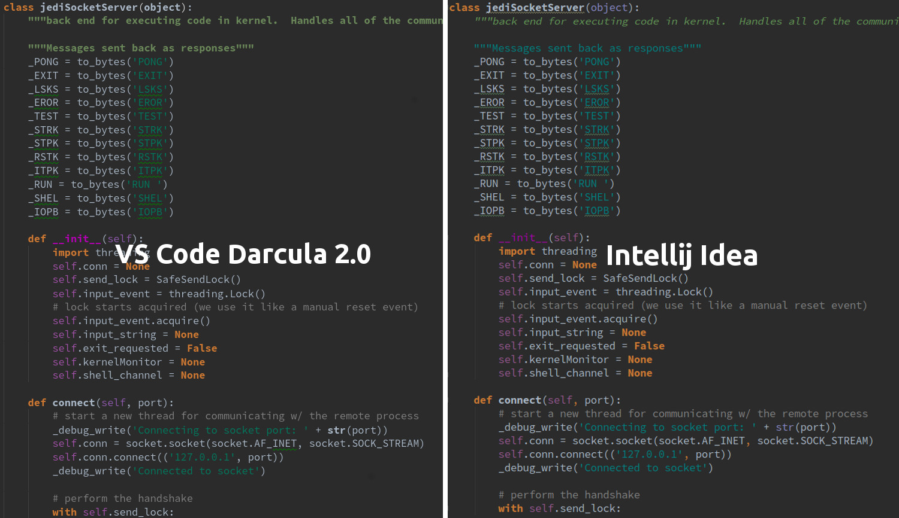

# Dracula 2.0 Theme
Reworked "Darcula Theme inspired by IntelliJ" to support Python with "MagicPython" highlither.

## Preview

## Contributing

If you'd like to contribute to this theme, please post an issue or PR on [GitHub](https://github.com/danields761/vs-code-darcula20-theme).

## License

MIT License

**Enjoy!**
