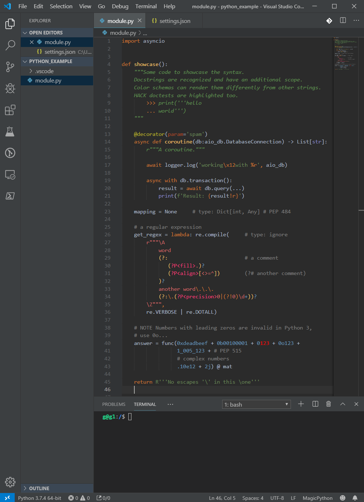
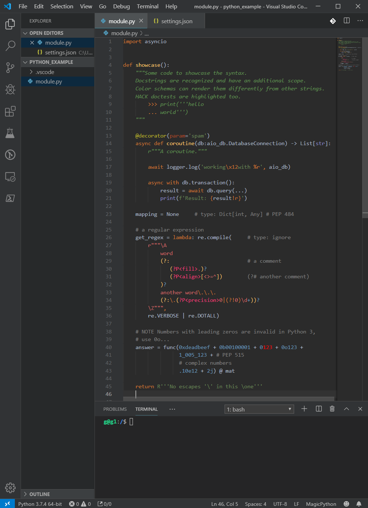

# Darcula PyCharm

 

Replica of Darcula PyCharm color scheme, optimized for Python.

- Dark and Light GUI options
- MagicPython RegEx highlighting
- Overridable base highlight (See [Customization](#customization))
- Supports popular languages (Javascript, HTML, CSS, & more) 

 <table>
  <tr>
    <th>Light</th>
    <th>Dark</th>
  </tr>
  <tr>
    <td></td>
    <td> </td>
  </tr>
</table>

## Customization 

To change the base text color, use a snippet like this in your `settings.json`

```json
{
    "editor.tokenColorCustomizations": {
        "[Darcula Pycharm with Dark GUI]": {
            "textMateRules": [
                {
                    "name": "Foreground base syntax",
                    "scope": [
                        "text", // For markup
                        "source", // For code
                    ],
                    "settings": {
                        "foreground": "#FF0000" // Bright red
                    }
                },
            ]
        },
    }
}
```